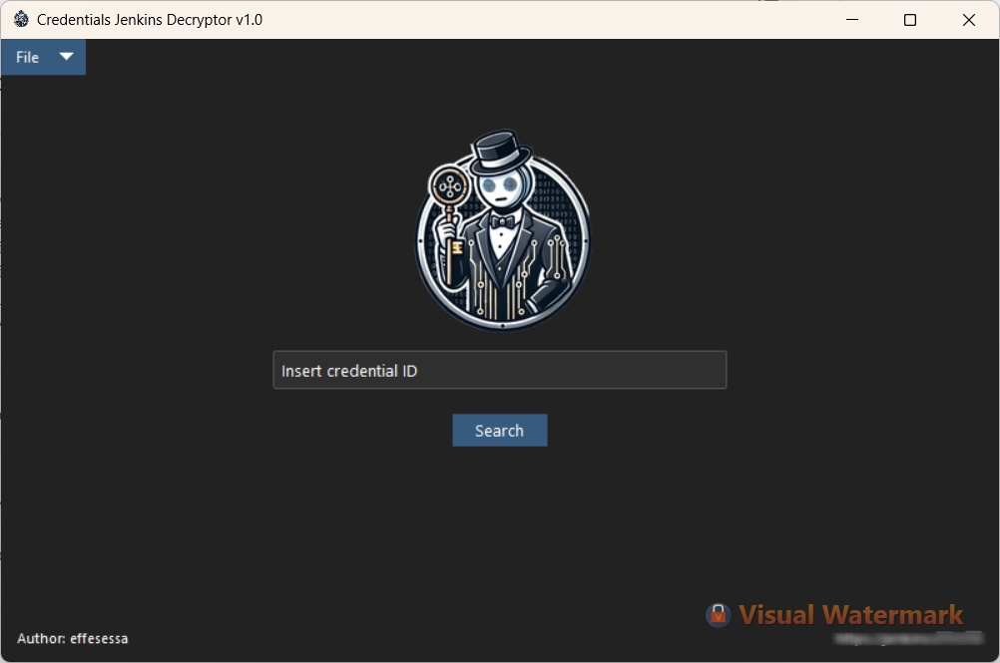
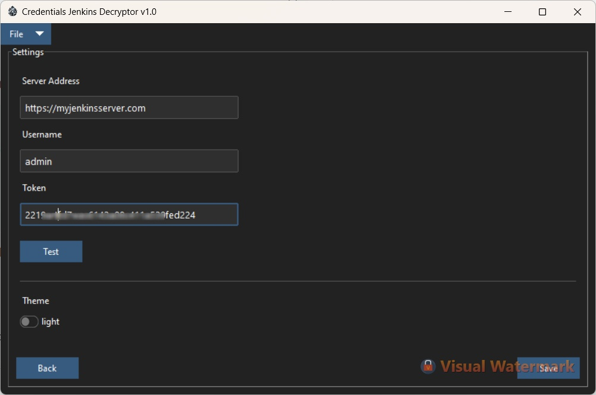
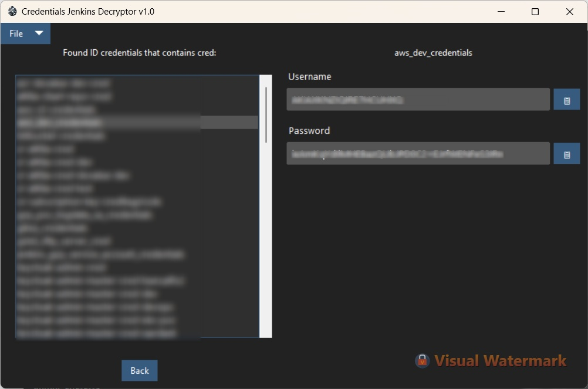

# Credentials Jenkins Decryptor


Effortlessly retrieve decrypted credentials from Jenkins in just a few clicks! This tool simplifies the process of extracting plaintext credentials stored on a Jenkins server, eliminating the tedious and time-consuming steps described in various online guides.

---

## 🌟 Why This Project?

Managing credentials on Jenkins servers can be cumbersome. To retrieve plaintext values of stored credentials, you often need to follow a series of complex steps that take several minutes. This project was born to streamline and automate that process, making it faster and more user-friendly.

---

## 🚀 Features

- **Supported Credential Types**:
  - `UsernamePassword`
  - `File`
  - `String` or `Secret`
- **Server Configuration**: 
  - Easily configure your Jenkins server, including setting the server URL, username, and token. These settings are saved to a `.ini` file, which is stored locally for convenience. 
    - On **Windows**, the configuration file is saved at:  
    `C:\Users\<YourUsername>\AppData\Roaming\jenkins-decryptor\config.ini`
    - On **macOS/Linux**, the configuration is stored at:  
    `~/.config/jenkins-decryptor/config.ini`
- **Search Functionality**:
  - Quickly find credentials by searching with keywords or text contained in a credential (supports `contains` search).
- **Credential Actions**:
  - View and copy `UsernamePassword` and `String/Secret` credentials with a single click.
  - Download `File` credentials by right-clicking and selecting the desired save location.
- **Theme Options**:
  - Choose between **Light** and **Dark** themes (default: Dark).

---

## 🛠️ Technical Details

- **Jenkins Version Tested**: `2.440.1`
- **Python Version Used**: `3.13.0`

---

## 📦 Installation and Build App

Follow these steps to install and build the application executable.

### 1. Clone the repository
Clone the GitHub repository to your local system:
```bash
git clone https://github.com/effesessa/credentials-jenkins-decryptor.git
cd credentials-jenkins-decryptor
```

### 2. Install dependencies
Install the required Python libraries listed in the requirements.txt:
```bash
pip install -r requirements.txt
```

### 3. Install PyInstaller
Install PyInstaller to build the application executable:
```bash
pip install pyinstaller
```

### 4. Build the application
Run the following command to build the application executable:
```bash
pyinstaller --onedir --windowed \ 
--icon="./images/jenkinsd-transformed.ico" \ 
--add-data "images/jenkinsd-transformed.webp:./images" \ 
--add-data "images/jenkinsd-transformed.ico:./images" \ 
--add-data "groovy/find_contains.groovy:./groovy" \ 
--add-data "groovy/get_value.groovy:./groovy" \ 
app.py
```
After running this command, a new directory called dist will be created in your project folder. Inside the dist directory, you'll find the folder containing the generated executable.

### 5. Run the application
Navigate to the dist directory and locate the generated application folder. Run the executable file.

---
</br>
</br></br>

</br>

</br>
